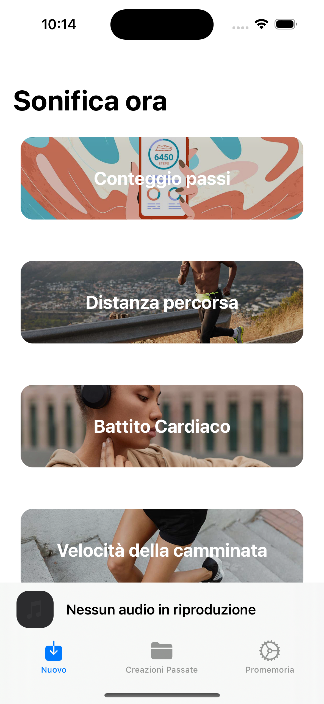
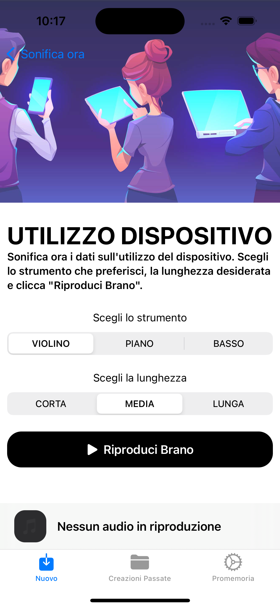
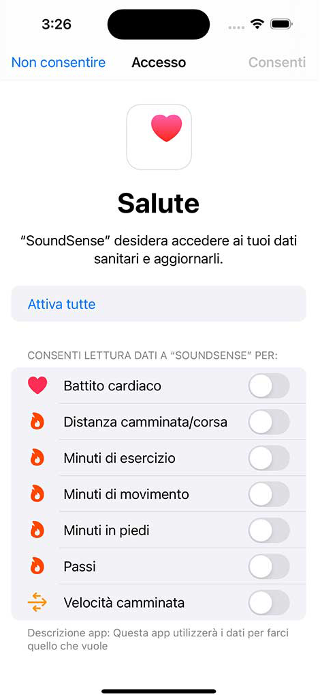
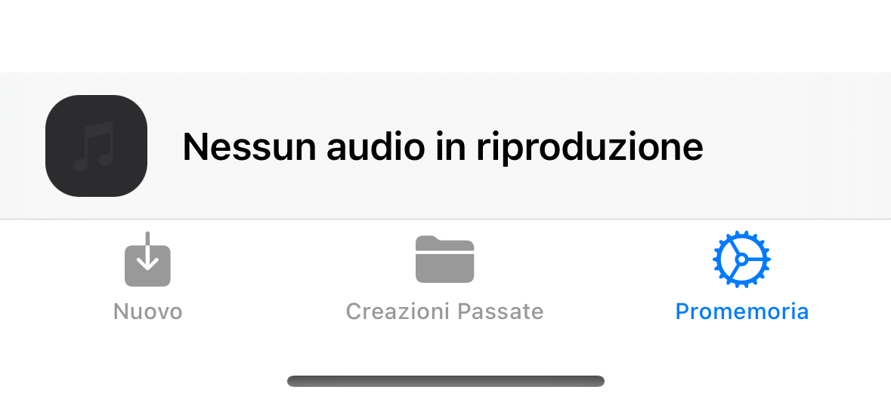
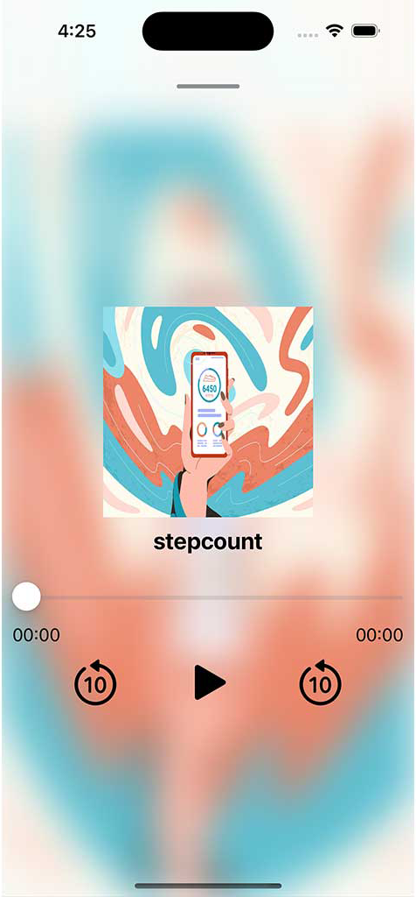

<!-- Improved compatibility of back to top link: See: https://github.com/othneildrew/Best-README-Template/pull/73 -->

<!--
*** Thanks for checking out the Best-README-Template. If you have a suggestion
*** that would make this better, please fork the repo and create a pull request
*** or simply open an issue with the tag "enhancement".
*** Don't forget to give the project a star!
*** Thanks again! Now go create something AMAZING! :D
-->

<!-- PROJECT LOGO -->
 

  <h3 align="center">SoundSense SERVER</h3>
  

    Raising Awareness of Digital Wellbeing: Data Visualization and Sonification in a Mobile Application
     
     
    <a href="https://github.com/ongaroandrea/SoundSense_Server"><strong>Explore Documentation </strong></a>
     
     
    <a href="https://github.com/ongaroandrea/SoundSense_Server">View Demo</a>
  

<!-- TABLE OF CONTENTS -->

  
Table of contents

  <ol>
    <li>
      <a href="#il-progetto">Project</a>
    </li>
    <li>
      <a href="#realizzato-con">Built with</a>
    </li>
    <li>
      <a href="#per-iniziare">To start</a>
      <ul>
        <li><a href="#prerequisiti">Prerequisities</a></li>
        <li><a href="#api">API</a></li>
      </ul>
    </li>
    <li><a href="#screenshot">Screenshot</a></li>
    <li><a href="#contatti">Contacts</a></li>
  </ol>

<!-- ABOUT THE PROJECT -->
## Project
<b>Supervisor</b>:  Dott.ssa Prandi Catia  
<b>Co-Supervisor</b>: Dott.ssa Chiara Ceccarini

Technology plays a significant role in most people’s lives, but how can we ensure it enhances our lives rather than distracting us from them?

With today’s smartphones, social media, and endless streams of content, many are quick to condemn technology based on the belief that these products harm mental health and overall wellbeing. However, focusing solely on these potentially harmful effects prevents us from fully harnessing the benefits these tools offer while also managing their risks.

This is where digital wellbeing comes in: a term used to describe the impact of digital technologies and services on individuals’ mental, physical, social, and emotional health.

(<a href="#readme-top">back to top</a>)

### Realizzato con

* 
* 
* 
* 
* 
* 

(<a href="#readme-top">Tor</a>)

<!-- GETTING STARTED -->
## To start

(<a href="#readme-top">back to top</a>)

Set ip server inside the configuration file

<!-- USAGE EXAMPLES -->
## Screenshots

  

    <h3>Usage Data Selection Screen</h3>
    
  
 

    <h3>Step Data Selection Screen</h3>
    
    

      <h3>Music Player (No Audio)</h3>
    
  
 

    <h3>Health Data Access Request</h3>
    
    
 

      <h3>Music Player (No Audio)</h3>
       
      
 

        <h3>Music Player with Audio Enabled</h3>
    
        

(<a href="#readme-top">back to top</a>)

<!-- CONTACT -->
## Contacts

Andrea Ongaro  - andreaongaro103@yahoo.it | andrea.ongaro2@studio.unibo.it

Project Link: [https://github.com/ongaroandrea/SoundSense_Client](https://github.com/ongaroandrea/SoundSense_Client)

(<a href="#readme-top">back to top</a>)

[product-screenshot]: images/screenshot.png

